## Featured Work

<table>
  <tr>
    <td width="50%" valign="top">
      <h3><a href="https://munmai.com">Munmai</a></h3>
      
A production-deployed financial clarity platform for transactions, receipts, statement imports, shared expenses, and monthly insights.

      
<strong>Status:</strong> Live product

      
<strong>Stack:</strong> React, TypeScript, Node.js, Express, MongoDB

      
<a href="https://munmai.com">Live</a> · <a href="https://github.com/kshitijchaudhary/munmai">Repository</a>

    </td>
    <td width="50%" valign="top">
      <h3>NepStack</h3>
      
A collaborative engineering initiative focused on production-grade delivery, reusable engineering practices, and human-AI software workflows.

      
<strong>Status:</strong> Active development

      
<strong>Focus:</strong> Architecture, testing, documentation, CI/CD, and AI-assisted engineering

    </td>
  </tr>
</table>

## Engineering Focus

- Production full-stack applications
- Backend architecture and API design
- CI/CD and cloud deployment
- Applied AI, RAG, and agent workflows

## Technology

TypeScript, JavaScript, React, Angular, Node.js, Express, .NET, Python, MongoDB, PostgreSQL, Docker, GitHub Actions

## Connect

- [Portfolio](https://chaudharykshitij.com.np)
- [LinkedIn](https://www.linkedin.com/in/kshitijchaudhary)
- [Munmai](https://munmai.com)
