<picture>
  <source media="(prefers-color-scheme: dark)" srcset="./assets/profile.svg">
  <source media="(prefers-color-scheme: light)" srcset="./assets/profile.svg">
  
</picture>

## Featured Projects

### [Munmai](https://munmai.com)

A production-deployed financial clarity platform for tracking income, expenses, receipts, statement imports, shared expenses, and monthly insights.

**Highlights**

- Receipt and PDF statement imports
- Duplicate-import protection
- Shared expenses and group workflows
- Monthly financial summaries
- Authentication and protected user data
- Production deployment and CI/CD

**Stack:** React, TypeScript, Node.js, Express, MongoDB

---

### NepStack

A collaborative engineering initiative focused on production-grade software delivery, reusable engineering practices, and human-AI development workflows.

**Current work:** Architecture, team workflows, pull-request discipline, testing, and engineering documentation.

---

## Current Focus

- Shipping and polishing Munmai
- Strengthening backend architecture and API design
- Building practical AI and LLM engineering skills
- Improving production deployment and CI/CD practices

## Connect

- [Portfolio](https://chaudharykshitij.com.np)
- [LinkedIn](https://www.linkedin.com/in/kshitijchaudhary)
- [Munmai](https://munmai.com)
